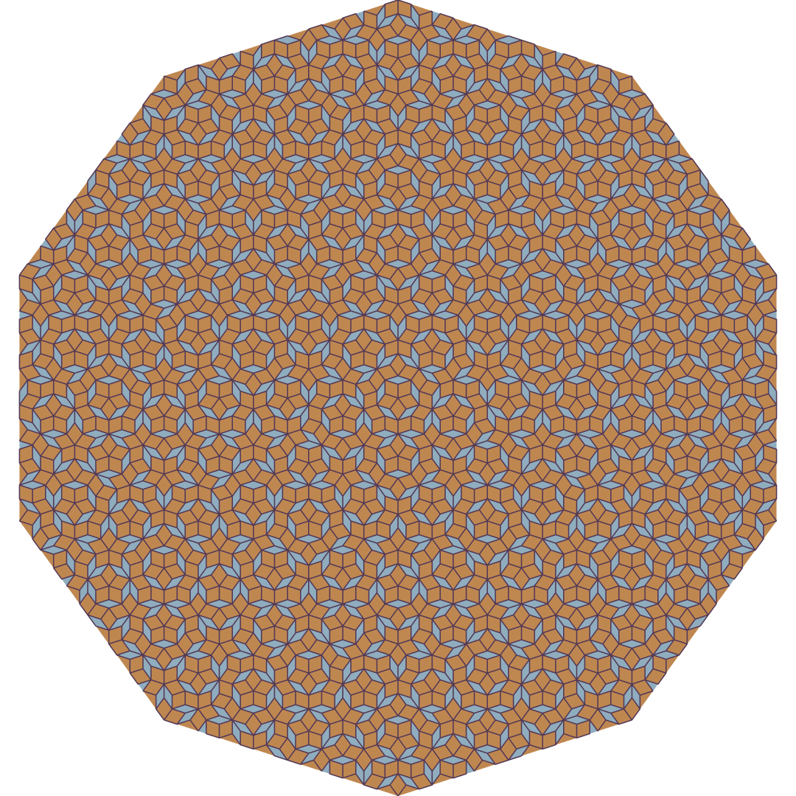
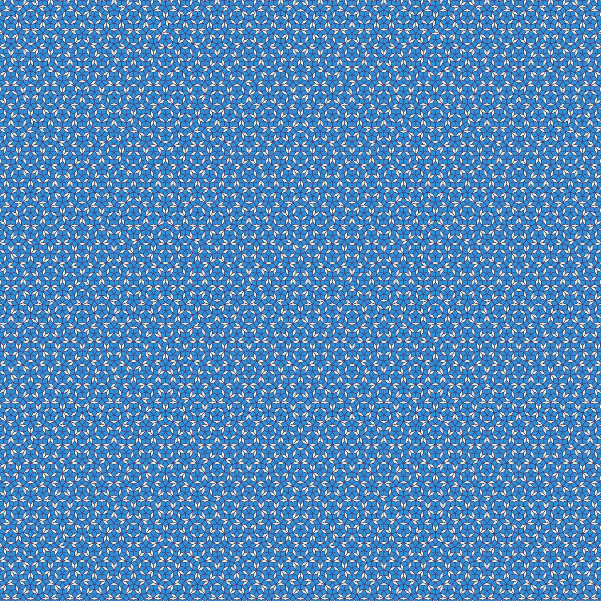

# Penrose Tiling Generator

### Introduction

This is a highly customizable penrose tiling generator using python.

A penrose tiling is a tiling of shapes (in this code, a thin and a thick rhombus) that has five-fold roational symmetry, reflection symmetry, but not translational symmetry. What this means is that the pattern will never repeat, even if you continue it to infinity.

For more on penrose tilings, you may wish to consult the [wiki page](https://en.wikipedia.org/wiki/Penrose_tiling).

Examples are at the [bottom](#examples).

### Usage

When running the code, you will be prompted to enter 5 pieces of information:
- Number of Tiling Layers/Subdivions 
    - This code generates the tiling by subdiving triangles, which are in pairs to from the rhombi
    - This gets intricate quickly, and depending on your computer, anything above 10 may not render so quickly
    - Example: `7`
- Zoom
    - You can decide whether or not to zoom in
    - When zoomed in, the entire rectangle is filled with the pattern
    - If you want the whole decagon (currently only with transparent background), you can choose to not zoom in
    - The only valid options are `in` and `out`
- Image Resolution
    - This code will output the tiling as a png file
    - You can specify the resolution of the image
    - The scale of the tiling will remain unaffected
    - Example: `1080 1080`
- Colors
    - Here you can have fun and pick the colors you want the tiling to be in
    - You can choose the color of the thin rhombi, the thick rhombi, and the outline
    - Presets: `red`, `orange`, `yellow`, `green`, `blue`, `purple`, `grey`, `brown`, `black`, `white`
    - Hex Color Codes are also supported - ex. `a48432`
    - If you really want to have some fun (or are lazy like me), use `random`
    - Example: `red c27320 random`
- Output Filename
    - This will determine the name of the file that will house your penrose tiling
    - This file is a png and **must** end in `.png`
    - Filepaths are in theory supported, though not thoroughly tested
    - Example: `example.png`

### The Code

While the customizability and most of the rendering logistics were created by me, I had help with the mathematical portion of the code.

[Preshing.com](https://preshing.com/) has a great article [here](https://preshing.com/20110831/penrose-tiling-explained/) on how the theory behind this works, and some code that I based my own code off of. 

A basic rundown of the functionality of my code is:
1. Prompt the user for the customization options,then parse them and raise errors if they are not correct
2. Create the 10 large trinagles
3. Loop to divide each triangle the specified number of times
4. Color the triangles
5. Outline the triangles to highlight the rhombi

### Examples

#### 2 Tiling Layers
&nbsp;&nbsp;&nbsp;

#### 5 Tiling Layers

#### 7 Tiling Layers

#### 10 Tiling Layers

#### 13 Tiling Layers (8k resolution)

